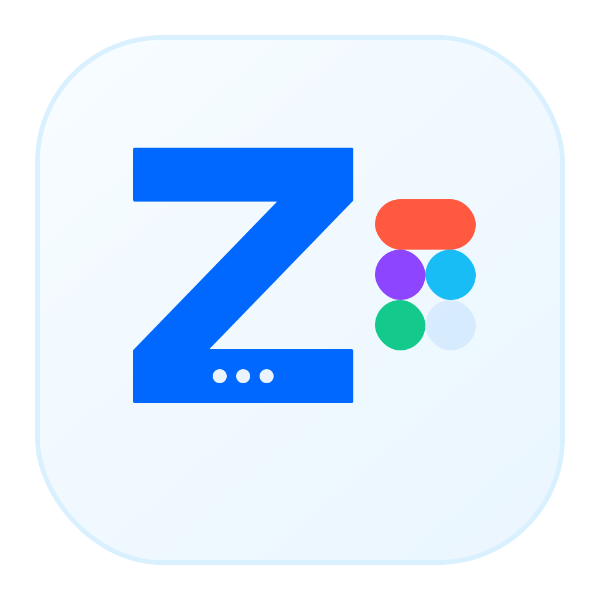

<p align="center">
  
</p>

<h1 align="center">za-talk-to-figma</h1>

`za-talk-to-figma` is a local Figma execution runtime for AI workflows. It connects an MCP-compatible client to a live Figma file, applies runtime policies around heavy reads and fallbacks, and exposes both low-level capabilities and higher-level smart workflows.

## Runtime shape

```text
cmd/za-talk-to-figma/   runtime entrypoint
core/                   runtime engine, bridge, capability surface, workflows, playbooks
core/controlplane/      embedded `/admin` control plane frontend
core/events/            runtime event model and bounded event buffer
plugin/                 Figma runtime bridge and Runtime Console UI
npm/                    packaged launcher wrapper
docs/                   execution model, runtime architecture, plugin events
```

## Connect a client

`za-talk-to-figma` is an MCP server — drive it from Claude, Codex, Antigravity,
Cursor, VS Code Copilot, or any MCP-compatible client. The invocation is always
`npx -y za-talk-to-figma` over stdio. See **[docs/usage.md](docs/usage.md)** for
per-client setup, configuration, the diagnostics tools, and the error contract.

```bash
# Claude Code
claude mcp add za-talk-to-figma -- npx -y za-talk-to-figma
```

## Runtime surfaces

- **Plugin Session UI**: an ultra-compact console inside Figma for the active file/session
- **Server Control Plane**: `http://127.0.0.1:1802/admin` for runtime-wide overview, sessions, routes, and recent events

## Current capabilities

- Read live Figma document data safely with context-aware fallbacks
- Route work across live runtime sessions and switch the active session when multiple Figma files are connected
- Maintain a bounded runtime event stream shared by plugin logs and the `/admin` control plane
- Keep client-aware default routes so multiple MCP processes can avoid trampling each other
- Write and modify nodes, styles, variables, components, pages, and prototype reactions
- Advanced editing: restyle existing text typography (`set_text_properties`), combine shapes with boolean operations (`boolean_operation`), and flatten geometry (`flatten_node`)
- Export screenshots, PDFs, and token bundles
- Run smart workflows such as:
  - `inspect_selection_safely`
  - `review_canvas_layout`
  - `cleanup_board_layout`
  - `prepare_export_bundle`
  - `safe_page_inventory`
  - `extract_component_candidates`
  - `normalize_review_board`
  - `get_runtime_sessions`
  - `set_runtime_session`
- Diagnose the runtime over MCP, even when no plugin is connected:
  - `get_runtime_health` — role, plugin connection, active session, pending requests, log level
  - `get_recent_events` — the runtime event stream (execution reports, errors, session changes)
- Generate a standalone Zinstant scaffold from Figma context

## Logging & observability

Logs are structured and leveled (via `log/slog`) and always go to **stderr**
(stdout carries the MCP protocol). Tune them with environment variables:

| Variable        | Values                        | Default | Purpose |
|-----------------|-------------------------------|---------|---------|
| `ZA_LOG_LEVEL`  | `debug` `info` `warn` `error` | `info`  | Per-request traces live at `debug`; use `warn` in production. |
| `ZA_LOG_FORMAT` | `text` `json`                 | `text`  | `json` for log pipelines; `text` for local dev. |

Tool failures return a typed JSON envelope — `{"error":{"code","message","retryable"}}`
— so clients can distinguish a timeout from a disconnect from a plugin-side
error without parsing prose. Codes and recovery guidance are documented in
[docs/usage.md](docs/usage.md#5-error-contract).

## Local build

```bash
make build
```

## Tests

```bash
make test
```

## Runtime config

Optional runtime config can be provided through `za-talk-to-figma.json`:

```json
{
  "defaultMode": "free",
  "allowPromptModeOverride": false,
  "generatedRoot": "generated"
}
```

## Design references

If you want AI to keep a steadier design taste without hardcoding a design system into the runtime, add a root-level `DESIGN.md`. The playbook layer will treat it as style guidance, while Figma canvas state remains the visual truth.

See [docs/design-references.md](docs/design-references.md) for the recommended workflow, including how to adapt material inspired by `awesome-design-md`.

## Operations

- [docs/runtime-architecture.md](docs/runtime-architecture.md)
- [docs/plugin-runtime-events.md](docs/plugin-runtime-events.md)
- [docs/smoke-checklist.md](docs/smoke-checklist.md)

## Dev reload

- `make build-and-reload`: rebuild the Go binary and hot-reload running MCP/runtime processes in place.
- `make dev-watch`: watch `cmd/`, `core/`, and `plugin/src/`; rebuild on change, reload the Go MCP/runtime, and rebuild the plugin bundle when UI code changes.
- Hot reload relies on the MCP/runtime process running the local `bin/za-talk-to-figma` binary directly.
